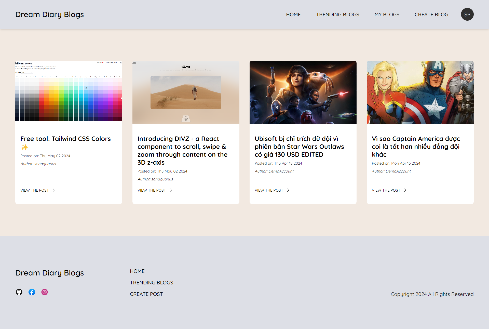

# DREAM DIARY BLOG

## Dream Diary Blog is personal blog website

## Table of Contents

- [Demo](#demo)
- [Technologies And Packages Used](#mag_righttechnologies-and-packages-used)
- [Features](#pencilfeatures)
- [Screenshots](#camerascreenshots)
- [Setup](#wrenchsetup)

## Demo

[Live Demo](https://vueblog-f7532.web.app/) <br>
**You can use test account for the website**

- **Account Test**: <br>
  email: admin@gmail.com, <br>
  password: admin123

## :mag_right:Technologies And Packages Used

**Backend (Firebase):**

- Firestore Database
- Firebase Function
- Firebase Storage
- Firebase Hosting

**Frontend:**

- Vue 3
- Vuex
- Vue Router

## :pencil:Features

List the ready features here:

- Register/Login
- Forgot Password/Reset Password
- Edit Your Profile
- Create Blog
- Management Blogs (Edit Blog, Delete Blog)
- View Trending Blogs
- Set another account as Admin (If own account is Admin)
- <del>Realtime Notification</del> (later update)

## :camera:Screenshots





## :wrench:Setup

- When clone my project to your computer, open it with VSCODE
- Install locally using npm, open Terminal in VSCODE:

```
install packages: $ npm i
```

- When after success install package for client and server, to run this project:

```
run project: $ npm run start
```
